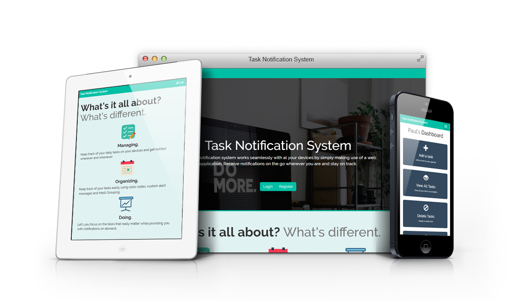

## 

##

# Task Notification System
Conventional task management systems, involve continuous collection of unnecessary personal information and storage. Thus, I decided to create my own task management system. App free, hassle free. A simple web app that requires me to login and pushes me notifications as long as I keep it open. 

## Installation
To install the task notification system on your desktop

1. `git clone https://github.com/ploh007/task-notification-system.git projectname`
2. `cd projectname`
3. `composer install`
4. `php artisan key:generate`
5. Create a database and inform .env file
6. `php artisan migrate --seed`
7. `php artisan serve`

## Development
To fix issues or contribute to the project, follow the steps below
 
1. Fork the repository
2. Create a new branch (`git checkout -b branch-name`)
3. Make the required changes
4. Commit changes (`git commit -m "Commit message"`)
5. Push the changes (`git push origin branch-name`)
6. Create a pull request

## Built Using
* [Laravel](https://laravel.com/) - A PHP Web Application Framework
* [Bootstrap](http://getbootstrap.com/) - A Front-End Development Framework
* [jQuery](https://jquery.com/) - A Java Script Framework

## Feature List
* Basic Authentication & Registration
* Home Page
* Task Controls
	* Create task with the following details
		* Name
		* Category
		* Due Date
		* Due Time
		* Notes
	* Mark Completion Status of Tasks (Complete / Incomplete)
	* Delete Tasks

## To-do
* Create dashboard with visualization for:
	* Task Count for given time frame (week, month, year)
	* Tasks metrics 
	* Estimation of time to complete tasks
* Add/Delete Task Categories 
* Calendar View for Tasks
* Desktop Browser Push Notifications
* REST API
* Responsive View
* Alert for tasks

## Nice-to-haves
* Color Scheme Customization

## License
MIT © [Paul Loh](http://paulloh.com)